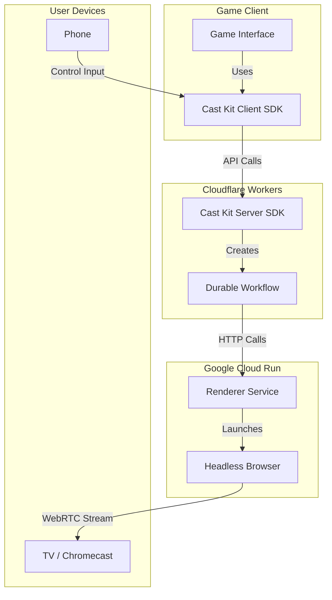

# 📺 Cast Kit

> Add TV casting to your web games in minutes

Cast Kit is a TypeScript library for adding TV casting capabilities to web games. It transforms phones into controllers and TVs into displays, enabling immersive gameplay experiences on larger screens.

[](https://www.npmjs.com/package/@open-game-collective/cast-kit)
[](https://www.typescriptlang.org/)
[](LICENSE)

## Features

- 🎮 **Phone as Controller** - Transform the player's phone into a game controller
- 📺 **TV as Display** - Stream your game to any Chromecast-enabled device
- 🌐 **Web-Based** - No native app required, works in the browser
- 🚀 **Easy Integration** - Add casting with just a few lines of code
- 🪄 **React Support** - Ready-to-use React components and hooks
- 🔎 **Inspector Tools** - Debug your cast sessions with built-in tools

## Architecture

Cast Kit consists of three main components:

1. **Client SDK**: Runs in the player's browser and provides the API for initiating and managing cast sessions
2. **Server SDK**: Runs on Cloudflare Workers and handles session management, communication, and coordination
3. **Renderer Service**: Runs in Google Cloud Run and manages browser instances for streaming game content to TVs



## Prerequisites

- **Cloudflare Workers** account with Workflows enabled
- **Google Cloud Run** access for the Renderer Service (or use our hosted service)
- **Node.js** 18+ and npm/yarn
- **TypeScript** 4.5+ (recommended)

## Quick Start

### 1. Install the package

```bash
npm install @open-game-collective/cast-kit
```

### 2. Client-Side Integration

```jsx
import { createCastClient } from '@open-game-collective/cast-kit/client';
import { CastButton } from '@open-game-collective/cast-kit/react';

// Create a client
const castClient = createCastClient({
  host: 'your-game-domain.com', // Your game's domain
});

// In your React component
function GameUI() {
  return (
    <div>
      <h1>Your Game</h1>
      <CastButton client={castClient} 
                 gameUrl="https://triviajam.tv/cast?gameId=123&roomCode=ABCD" />
    </div>
  );
}
```

### 3. Server-Side Integration (Cloudflare Workers)

```typescript
// wrangler.toml
// [See Cloudflare Workers setup below]

// src/worker.ts
import { createCastRouter } from '@open-game-collective/cast-kit/server';
import { createKVStorageHooks } from '@open-game-collective/cast-kit/server/storage';

export interface Env {
  CAST_SESSIONS: KVNamespace;
  RENDER_HOST: string;
  CAST_SESSION_WORKFLOW: any;
}

export default {
  async fetch(request: Request, env: Env, ctx: ExecutionContext) {
    const url = new URL(request.url);
    
    // Create storage hooks using Cloudflare KV
    const storageHooks = createKVStorageHooks(env.CAST_SESSIONS);
    
    // Create the cast router
    const castRouter = createCastRouter({
      renderHost: env.RENDER_HOST,  // Renderer service host
      storageHooks,
      workflowBinding: env.CAST_SESSION_WORKFLOW  // Workflow binding
    });
    
    // Handle cast routes
    if (url.pathname.startsWith('/api/cast/')) {
      return castRouter(request);
    }
    
    return new Response('Not Found', { status: 404 });
  }
};
```

## Detailed Setup Guide

### Client-Side Setup

The client-side SDK manages cast sessions and provides a UI for the player to initiate and control casting.

#### Basic Client Setup

```typescript
import { createCastClient } from '@open-game-collective/cast-kit/client';

// Create a cast client
const castClient = createCastClient({
  host: 'triviajam.tv',  // Your game's domain
});

// Create a broadcast session
async function startCasting() {
  try {
    // Generate a broadcast URL with game state
    const broadcastUrl = new URL('https://triviajam.tv/cast');
    broadcastUrl.searchParams.append('gameId', '123');
    broadcastUrl.searchParams.append('roomCode', 'ABCD');
    
    // Start broadcasting
    await castClient.createBroadcastSession({
      gameUrl: broadcastUrl.toString()
    });
    
    console.log('Started casting!');
  } catch (error) {
    console.error('Casting error:', error);
  }
}

// End the session
async function stopCasting() {
  await castClient.endSession();
  console.log('Stopped casting');
}
```

#### React Integration

Cast Kit provides React components and hooks for easy integration:

```jsx
import { 
  createCastKitContext, 
  CastButton, 
  CastStatus 
} from '@open-game-collective/cast-kit/react';
import { createCastClient } from '@open-game-collective/cast-kit/client';

// Create the context
export const CastKitContext = createCastKitContext();

// Create the client
const castClient = createCastClient({
  host: 'triviajam.tv'
});

// In your App component
function App() {
  return (
    <CastKitContext.Provider client={castClient}>
      <GameUI />
    </CastKitContext.Provider>
  );
}

// In your game UI component
function GameUI() {
  // Access client methods
  const client = CastKitContext.useClient();
  
  // Subscribe to specific state
  const isCasting = CastKitContext.useSelector(state => 
    state.session?.status === 'active'
  );
  
  // Create a URL with game state
  const getBroadcastUrl = () => {
    const url = new URL('https://triviajam.tv/cast');
    url.searchParams.append('gameId', '123');
    url.searchParams.append('roomCode', 'ABCD');
    return url.toString();
  };
  
  return (
    <div>
      <h1>Your Game</h1>
      
      {!isCasting ? (
        <CastButton onCast={() => {
          client.createBroadcastSession({
            gameUrl: getBroadcastUrl()
          });
        }} />
      ) : (
        <div>
          <CastStatus />
          <button onClick={() => client.endSession()}>
            Stop Casting
          </button>
        </div>
      )}
    </div>
  );
}
```

### Server-Side Setup (Cloudflare Workers)

The server-side component requires Cloudflare Workers with Workflows enabled.

#### 1. Configure wrangler.toml

```toml
name = "your-game-cast-router"
main = "src/worker.ts"
compatibility_date = "2023-12-01"

# KV Namespace for storing session data
[[kv_namespaces]]
binding = "CAST_SESSIONS"
id = "your-kv-namespace-id"  # Create this in the Cloudflare dashboard

# Environment variables
[vars]
RENDER_HOST = "https://renderer.triviajam.tv"  # Ask for access or host your own

# Workflow definition
[[workflows]]
name = "cast-session-workflow"
binding = "CAST_SESSION_WORKFLOW"
```

#### 2. Implement the Worker

```typescript
// src/worker.ts
import { createCastRouter } from '@open-game-collective/cast-kit/server';
import { createKVStorageHooks } from '@open-game-collective/cast-kit/server/storage';
import { CastSessionWorkflow } from '@open-game-collective/cast-kit/server/workflows';

export interface Env {
  CAST_SESSIONS: KVNamespace;
  RENDER_HOST: string;
  CAST_SESSION_WORKFLOW: any;
}

// Export the workflow class for Cloudflare Workflows
export { CastSessionWorkflow };

export default {
  async fetch(request: Request, env: Env, ctx: ExecutionContext) {
    const url = new URL(request.url);
    
    // Create storage hooks using Cloudflare KV
    const storageHooks = createKVStorageHooks(env.CAST_SESSIONS);
    
    // Create the cast router
    const castRouter = createCastRouter({
      renderHost: env.RENDER_HOST,
      storageHooks,
      workflowBinding: env.CAST_SESSION_WORKFLOW
    });
    
    // Handle cast routes
    if (url.pathname.startsWith('/api/cast/')) {
      return castRouter(request);
    }
    
    return new Response('Not Found', { status: 404 });
  }
};
```

#### 3. Deploy to Cloudflare

```bash
npx wrangler publish
```

### Broadcast Page

The broadcast page is what viewers will see on the TV. This page should be optimized for TV display and connect to your game's state management system.

```jsx
// pages/cast.tsx or similar
import { useEffect, useState } from 'react';
import { useGameState } from '../hooks/useGameState';

export default function CastPage() {
  // Get game parameters from URL
  const [params, setParams] = useState(null);
  
  useEffect(() => {
    const urlParams = new URLSearchParams(window.location.search);
    setParams({
      gameId: urlParams.get('gameId'),
      roomCode: urlParams.get('roomCode')
    });
  }, []);
  
  // Connect to game state if we have params
  const { gameState, loading, error } = useGameState(params?.gameId, params?.roomCode);
  
  if (!params) return <div>Loading...</div>;
  if (loading) return <div>Connecting to game...</div>;
  if (error) return <div>Error connecting to game: {error.message}</div>;
  
  return (
    <div className="tv-display">
      {/* Game display optimized for TV */}
      <GameDisplay gameState={gameState} isTvMode={true} />
    </div>
  );
}
```

## API Reference

### Client SDK

```typescript
interface CastClient {
  // Create a new broadcast session
  createBroadcastSession(options: {
    gameUrl: string,      // URL to your game's broadcast page
    sessionData?: any     // Optional data to include with the session
  }): Promise<CastSession>;
  
  // Get the current session
  getSession(): CastSession | null;
  
  // End the current session
  endSession(): Promise<void>;
  
  // Get the current state
  getState(): CastState;
  
  // Subscribe to state changes
  subscribe(listener: (state: CastState) => void): () => void;
}

interface CastState {
  isCreatingSession: boolean;
  error: Error | null;
  session: CastSession | null;
}

interface CastSession {
  sessionId: string;
  status: 'created' | 'connecting' | 'active' | 'error' | 'terminated';
  createdAt: string;
  error?: string;
}
```

### React Components

```typescript
// CastButton props
interface CastButtonProps {
  onCast?: () => void;        // Called when the button is clicked
  disabled?: boolean;         // Disable the button
  className?: string;         // CSS class
  label?: string;             // Button text
}

// CastStatus props
interface CastStatusProps {
  className?: string;         // CSS class
  showEndButton?: boolean;    // Show the "End Casting" button
  onEnd?: () => void;         // Called when end button is clicked
}
```

### Server SDK

```typescript
interface CastRouterOptions {
  renderHost: string;         // URL to the Renderer service
  storageHooks?: StorageHooks; // Custom storage implementation
  workflowBinding: any;       // Cloudflare Workflow binding
}

// Create a router for handling cast requests
function createCastRouter(options: CastRouterOptions): (request: Request) => Promise<Response>;

// Create storage hooks using Cloudflare KV
function createKVStorageHooks(namespace: KVNamespace): StorageHooks;
```

## Advanced Usage

### Custom Storage

Cast Kit uses Cloudflare KV by default, but you can implement custom storage:

```typescript
import { StorageHooks } from '@open-game-collective/cast-kit/server';

// Custom storage implementation
const customStorage: StorageHooks = {
  saveSession: async (session) => {
    // Save session to your storage
  },
  
  getSession: async (sessionId) => {
    // Get session from your storage
  },
  
  updateSession: async (sessionId, updates) => {
    // Update session in your storage
  },
  
  deleteSession: async (sessionId) => {
    // Delete session from your storage
  },
  
  listActiveSessions: async () => {
    // List active sessions from your storage
  }
};

// Use custom storage with the router
const castRouter = createCastRouter({
  renderHost: env.RENDER_HOST,
  storageHooks: customStorage,
  workflowBinding: env.CAST_SESSION_WORKFLOW
});
```

### Debugging

Cast Kit includes debugging tools to help troubleshoot cast issues:

```typescript
// Enable verbose logging
const castClient = createCastClient({
  host: 'triviajam.tv',
  debug: true
});

// Access logs
const logs = castClient.getLogs();
console.table(logs);

// Monitor session events
castClient.subscribe((state) => {
  console.log('Cast state updated:', state);
});
```

## Game Setup Considerations

### 1. Create a TV-Optimized Game View

- Design a fullscreen layout suitable for TV viewing
- Use larger text and UI elements
- Ensure good visibility from a distance
- Optimize for 16:9 aspect ratio
- Test on actual TV devices

### 2. Implement State Synchronization

Your broadcast page needs to connect to your game's state management system:

```typescript
// Example connection to a game server
function connectToGameState(gameId, roomCode) {
  const socket = new WebSocket(`wss://triviajam.tv/api/game/${gameId}/room/${roomCode}`);
  
  socket.onmessage = (event) => {
    const gameState = JSON.parse(event.data);
    // Update UI with new game state
    updateGameDisplay(gameState);
  };
  
  return () => socket.close(); // Return cleanup function
}
```

### 3. Performance Optimization

Ensure your broadcast page performs well:

- Limit animations and effects that might cause performance issues
- Optimize rendering for smooth frame rates
- Minimize network requests
- Use efficient canvas rendering when possible
- Test on lower-end devices

## Troubleshooting

### Common Issues

#### Cast Button Doesn't Work

- Ensure your Chromecast device is on the same network
- Check browser compatibility (Chrome is recommended)
- Verify that the Google Cast extension is enabled
- Try restarting your Chromecast device

#### Streaming Issues

- Check network connectivity and stability
- Ensure your broadcast page loads correctly in a standalone browser
- Verify WebRTC is not blocked by firewalls or security settings
- Test with a simpler game view to isolate performance issues

#### Server Integration Problems

- Confirm Cloudflare Workers is properly configured
- Verify KV namespace is correctly set up
- Check that Workflows is enabled on your account
- Ensure the Renderer service URL is correct

#### Error Handling

Cast Kit provides detailed error information:

```typescript
castClient.subscribe((state) => {
  if (state.error) {
    console.error('Cast error:', state.error);
    // Show user-friendly error message
    showErrorToUser(state.error.message);
  }
});
```

## Limitations

- **Browser Support**: Cast Kit works best in Chrome and Chrome-based browsers
- **Cloudflare Requirement**: Server-side components require Cloudflare Workers with Workflows
- **Network Dependencies**: Stable network connection is required for smooth streaming
- **WebRTC Constraints**: Performance depends on the capabilities of the broadcasting and receiving devices

## FAQ

### Q: Do I need to implement my own Chromecast receiver app?
A: No. Cast Kit uses a universal receiver that works with any game. You just need to create a broadcast page on your domain.

### Q: How do I handle player input while casting?
A: Your game client becomes a controller when casting is active. Use your existing input handling code, but display the controller UI instead of the game UI.

### Q: Is there a cost to using Cast Kit?
A: Cast Kit itself is free and open source. You'll need a Cloudflare Workers account (which has a generous free tier) and access to the Renderer service (which can be self-hosted or used as a service).

### Q: How many concurrent cast sessions can I support?
A: This depends on your Cloudflare Workers limits and the Renderer service capacity. The default Renderer configuration supports 50 concurrent sessions.

### Q: Can I use Cast Kit with any game?
A: Yes, Cast Kit works with any web-based game that can expose a broadcast view. Games using canvas, WebGL, or DOM-based rendering are all supported.

## Support and Community

- GitHub Issues: [https://github.com/open-game-collective/cast-kit/issues](https://github.com/open-game-collective/cast-kit/issues)
- Discord Community: [Join our Discord](https://discord.gg/opengamecollective)
- Email Support: [support@triviajam.tv](mailto:support@triviajam.tv)

## License

Cast Kit is licensed under the MIT License - see the [LICENSE](LICENSE) file for details.

---

Built with ❤️ by the [Open Game Collective](https://github.com/open-game-collective) 
