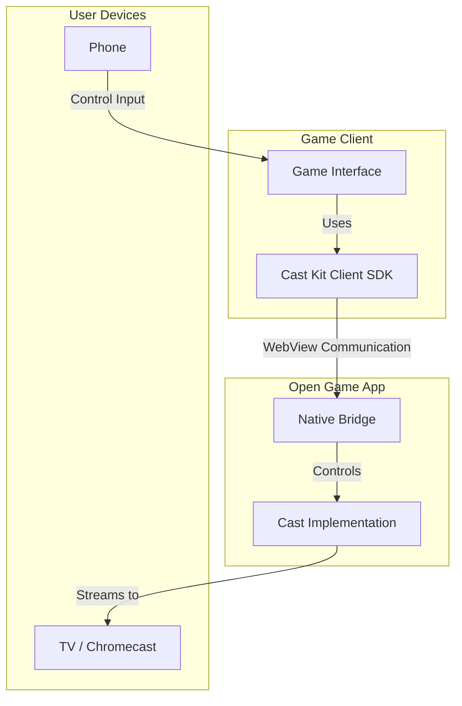

# 📺 Cast Kit

> Add TV casting to your web games in minutes

Cast Kit is a TypeScript library for adding TV casting capabilities to web games. It transforms phones into controllers and TVs into displays, enabling immersive gameplay experiences on larger screens.

[](https://www.npmjs.com/package/@open-game-system/cast-kit)
[](https://www.typescriptlang.org/)
[](LICENSE)

## Features

- 🎮 **Phone as Controller** - Transform the player's phone into a game controller
- 📺 **TV as Display** - Stream your game to any Chromecast-enabled device
- 🌐 **Web-Based** - No native app required, works in the browser
- 🚀 **Easy Integration** - Add casting with just a few lines of code
- 🪄 **React Support** - Ready-to-use React components and hooks
- 🔎 **Inspector Tools** - Debug your cast sessions with built-in tools

## Architecture

Cast Kit is a client-side library that interfaces with the Open Game mobile app to provide casting capabilities. The architecture is simple:

1. **Client SDK**: A React-based library that runs in the player's browser
2. **Open Game App**: Handles the actual casting to Chromecast devices

All server-side handling is managed through the Open Game infrastructure - no server implementation is required on your end.



## Prerequisites

- **React-based** web application
- **Modern browser** support
- Players use the **Open Game App** for casting

## Quick Start

### 1. Install the package

```bash
npm install @open-game-system/cast-kit
```

### 2. Client-Side Integration

```jsx
import { createCastClient } from '@open-game-system/cast-kit/client';
import { CastButton } from '@open-game-system/cast-kit/react';

// Create a client
const castClient = createCastClient();

// In your React component
function GameUI() {
  const gameId = "abc123"; 
  const roomCode = "XYZ789";
  
  // Initialize cast functionality
  React.useEffect(() => {
    castClient.signalReady({
      gameId,
      roomCode,
      broadcastUrl: `https://yourgame.com/tv?gameId=${gameId}&roomCode=${roomCode}`
    });
  }, []);
  
  return (
    <div>
      <h1>Your Game</h1>
      <CastButton client={castClient} />
    </div>
  );
}
```

## API Reference

### Client SDK

```typescript
// Create a client instance
const client = createCastClient({ debug?: boolean });

// Client interface
interface CastClient {
  // Get the current state
  getState(): CastState;
  
  // Subscribe to state changes
  subscribe(listener: (state: CastState) => void): () => void;
  
  // Signal that the game is ready to cast
  signalReady(params: SignalReadyParams): Promise<void>;
  
  // Scan for available cast devices
  scanForDevices(): Promise<void>;
  
  // Start casting to a device
  startCasting(deviceId: string, options?: CastOptions): Promise<void>;
  
  // Stop the current casting session
  stopCasting(): Promise<void>;
  
  // Send a state update to the cast session
  sendStateUpdate(state: Record<string, unknown>): Promise<void>;
  
  // Reset any error in the current state
  resetError(): void;
  
  // Get the list of debug logs (if debug mode is enabled)
  getLogs(): Array<{timestamp: number, type: string, message: string, data?: unknown}>;
}

// Parameters for signalReady method
interface SignalReadyParams {
  // Game identifier
  gameId: string;
  
  // Room code (if applicable)
  roomCode?: string;
  
  // URL to broadcast to the TV
  broadcastUrl?: string;
  
  // List of game capabilities
  capabilities?: string[];
}

// Options for starting a cast session
interface CastOptions {
  // Initial state to send to the cast session
  initialState?: Record<string, unknown>;
}

// Cast state
interface CastState {
  // Whether Cast SDK is available
  isAvailable: boolean;
  
  // Whether a cast session is active
  isCasting: boolean;
  
  // Whether a cast session is connecting
  isConnecting: boolean;
  
  // Whether the client is scanning for devices
  isScanning: boolean;
  
  // Name of the connected device (if any)
  deviceName: string | null;
  
  // ID of the connected device (if any)
  deviceId: string | null;
  
  // Current session ID (if any)
  sessionId: string | null;
  
  // List of available cast devices
  devices: CastDevice[];
  
  // Current error (if any)
  error: CastError | null;
}

// Cast device representation
interface CastDevice {
  // Unique identifier for the device
  id: string;
  
  // Human-readable name of the device
  name: string;
  
  // Type of device (e.g., 'chromecast')
  type: string;
  
  // Whether the device is currently connected
  isConnected: boolean;
}

// Cast error representation
interface CastError {
  // Error code
  code: string;
  
  // Error message
  message: string;
  
  // Additional error details
  details?: Record<string, unknown>;
}
```

### React Components

```typescript
// CastButton props
interface CastButtonProps {
  // Cast client instance (optional if using context)
  client?: CastClient;
  
  // Called when the button is clicked
  onCast?: () => void;        
  
  // Disable the button
  disabled?: boolean;         
  
  // CSS class
  className?: string;         
  
  // Button text
  label?: string;             
}

// CastStatus props
interface CastStatusProps {
  // Cast client instance (optional if using context)
  client?: CastClient;
  
  // CSS class
  className?: string;         
  
  // Show the "End Casting" button
  showEndButton?: boolean;    
  
  // Called when end button is clicked
  onEnd?: () => void;         
}
```

## Advanced Usage

### Custom UI

Cast Kit provides container components and hooks for building custom UIs:

```typescript
import { 
  createCastKitContext, 
  useCastSelector,
  useCastClient 
} from '@open-game-system/cast-kit/react';

// Create the context
export const CastKitContext = createCastKitContext();

// Custom component
function CustomCastButton() {
  // Access client methods
  const client = useCastClient();
  
  // Subscribe to specific state
  const isCasting = useCastSelector(state => state.isCasting);
  const deviceName = useCastSelector(state => state.deviceName);
  
  // Start the casting process
  const handleCastClick = async () => {
    if (isCasting) {
      await client.stopCasting();
    } else {
      // First scan for devices
      await client.scanForDevices();
      
      // User would select a device, then:
      // For this example, we'll auto-select the first available device
      const devices = client.getState().devices;
      if (devices.length > 0) {
        await client.startCasting(devices[0].id, {
          initialState: {
            gameState: "initializing",
            playerCount: 1
          }
        });
      }
    }
  };
  
  return (
    <button onClick={handleCastClick}>
      {isCasting ? `Stop Casting to ${deviceName}` : 'Cast to TV'}
    </button>
  );
}
```

### Debugging

Cast Kit includes debugging tools to help troubleshoot cast issues:

```typescript
// Enable verbose logging
const castClient = createCastClient({
  debug: true
});

// Access logs
const logs = castClient.getLogs();
console.table(logs);

// Monitor session events
castClient.subscribe((state) => {
  console.log('Cast state updated:', state);
});
```

## Game Setup Considerations

### 1. Create a TV-Optimized Game View

- Design a fullscreen layout suitable for TV viewing
- Use larger text and UI elements
- Ensure good visibility from a distance
- Optimize for 16:9 aspect ratio
- Test on actual TV devices

### 2. Using the Broadcast URL

The most important part of implementing Cast Kit is creating a broadcast URL that will be displayed on the TV. This URL should:

- Be a page within your game that's designed for TV viewing
- Accept parameters through the URL (typically gameId and roomCode)
- Display the appropriate game content based on these parameters

For example:
```jsx
// In your game component
function GameUI() {
  const gameId = "abc123";
  const roomCode = "XYZ789";
  
  // Initialize casting
  React.useEffect(() => {
    castClient.signalReady({
      gameId,
      roomCode,
      broadcastUrl: `https://yourgame.com/tv?gameId=${gameId}&roomCode=${roomCode}`
    });
  }, []);
  
  return (
    <div>
      <CastButton client={castClient} />
    </div>
  );
}
```

This URL is passed to the Cast Kit library, which will load this page on the TV when casting begins. Your broadcast page simply needs to read these parameters from the URL and show the appropriate content.

### 3. Performance Optimization

Ensure your broadcast page performs well:

- Limit animations and effects that might cause performance issues
- Optimize rendering for smooth frame rates
- Minimize network requests
- Use efficient canvas rendering when possible
- Test on lower-end devices

## Troubleshooting

### Common Issues

#### Cast Button Doesn't Work

- Ensure your Chromecast device is on the same network
- Check that the user is using the latest Open Game App
- Verify that the user has granted necessary permissions
- Try restarting the Chromecast device

#### Streaming Issues

- Check network connectivity and stability
- Ensure your broadcast page loads correctly in a standalone browser
- Verify WebRTC is not blocked by firewalls or security settings
- Test with a simpler game view to isolate performance issues

#### Error Handling

Cast Kit provides detailed error information:

```typescript
castClient.subscribe((state) => {
  if (state.error) {
    console.error('Cast error:', state.error);
    // Show user-friendly error message
    showErrorToUser(state.error.message);
  }
});

// You can also reset errors when they've been handled
castClient.resetError();
```

## Limitations

- **App Requirement**: Casting requires players to use the Open Game App
- **Network Dependencies**: Stable network connection is required for smooth streaming
- **WebRTC Constraints**: Performance depends on the capabilities of the broadcasting and receiving devices

## FAQ

### Q: Do I need to implement my own server for casting?
A: No. Cast Kit is a client-side only library. All server-side communication is handled through the Open Game infrastructure.

### Q: Do I need to implement my own Chromecast receiver app?
A: No. Cast Kit uses the Open Game App as a bridge to Chromecast. You just need to create a broadcast page on your domain.

### Q: How do I handle player input while casting?
A: Your game client becomes a controller when casting is active. Use your existing input handling code, but display the controller UI instead of the game UI.

### Q: Is there a cost to using Cast Kit?
A: Cast Kit itself is free and open source. Please contact Open Game system regarding usage terms.

### Q: Can I use Cast Kit with any game?
A: Yes, Cast Kit works with any web-based game that can expose a broadcast view. Games using canvas, WebGL, or DOM-based rendering are all supported.

## Support and Community

- GitHub Issues: [https://github.com/open-game-system/cast-kit/issues](https://github.com/open-game-system/cast-kit/issues)
- Discord Community: [Join our Discord](https://discord.gg/opengamesystem)
- Email Support: [support@triviajam.tv](mailto:support@triviajam.tv)

## License

Cast Kit is licensed under the MIT License - see the [LICENSE](LICENSE) file for details.

---

Built with ❤️ by the [Open Game Collective](https://opengame.org/collective) 
